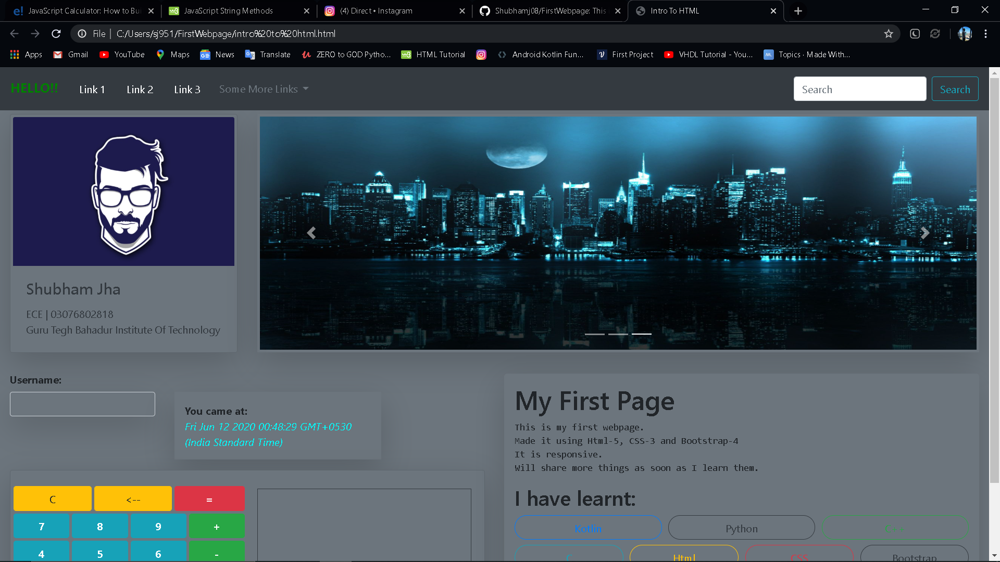
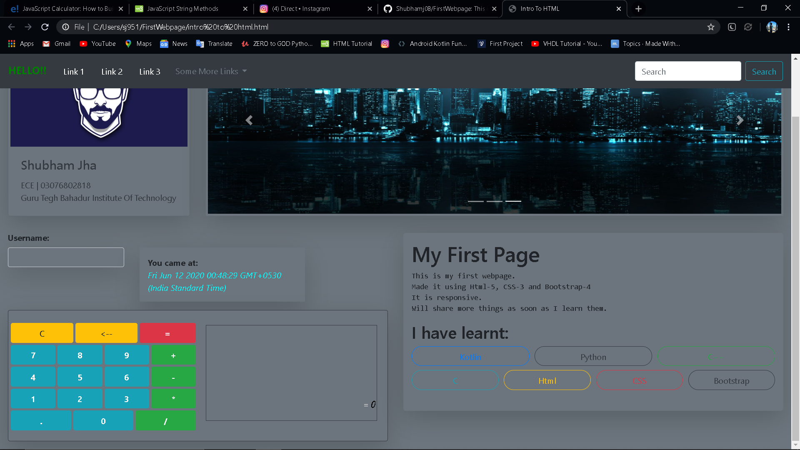

# FirstWebpage
<h3>This is my first Webpage</h3>

<b>Made it using Html-5, CSS-3 and Bootstrap-4 It is responsive. Will share more things as soon as I learn them.</b>

<h3>Screenshots from the page:</h3>

